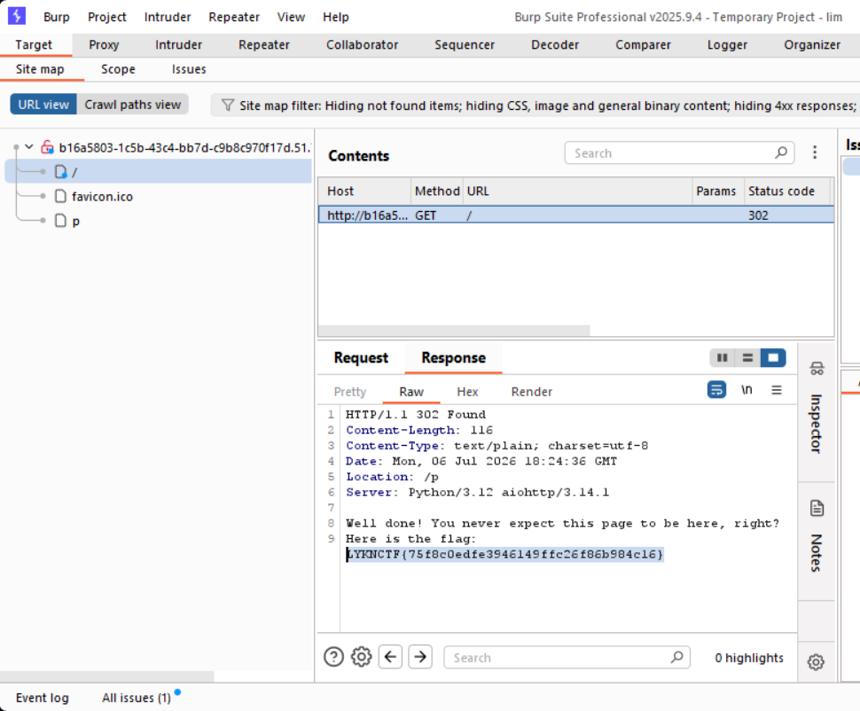
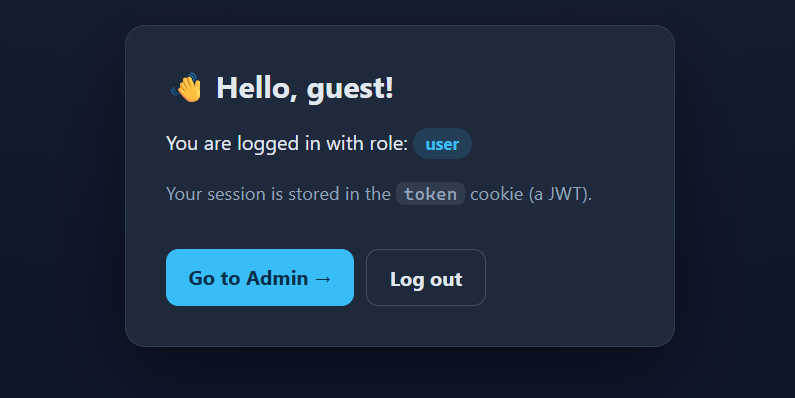
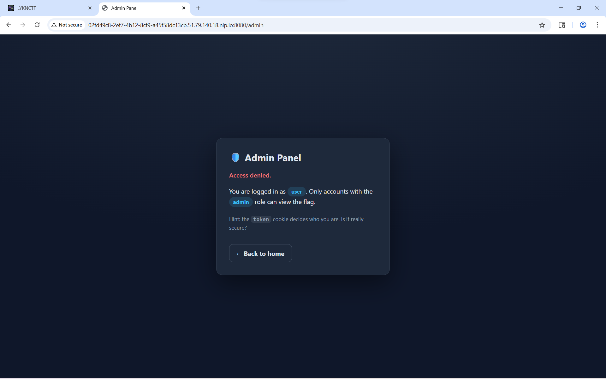
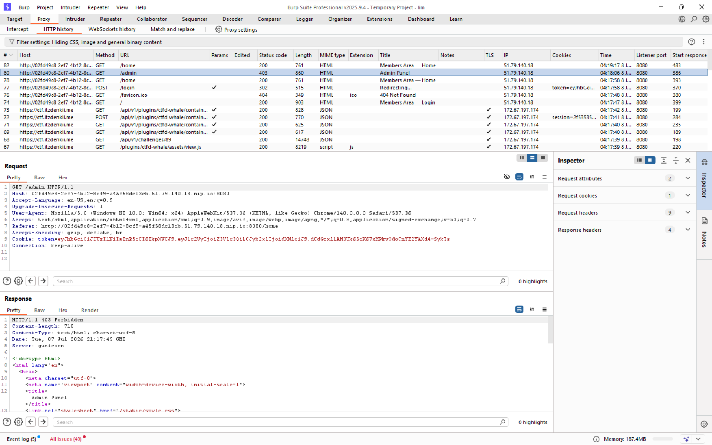
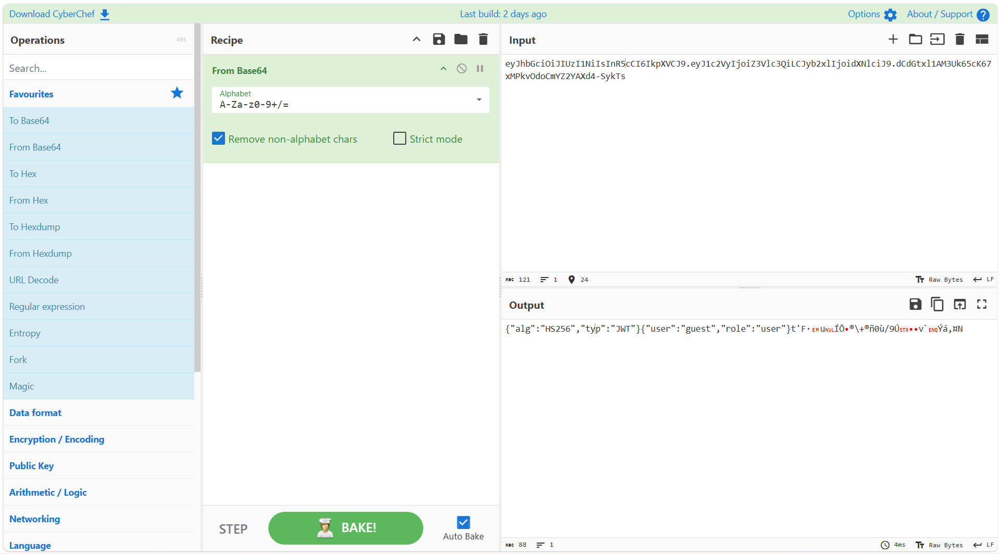
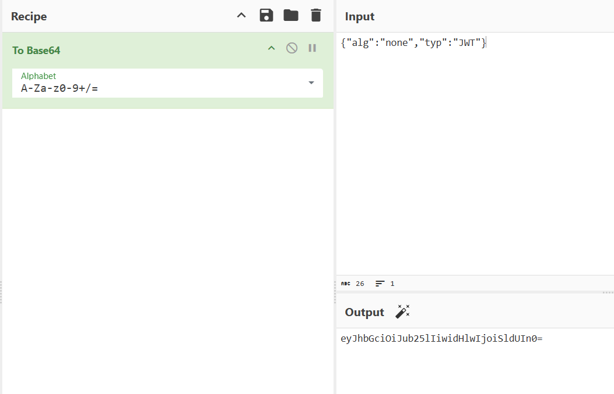
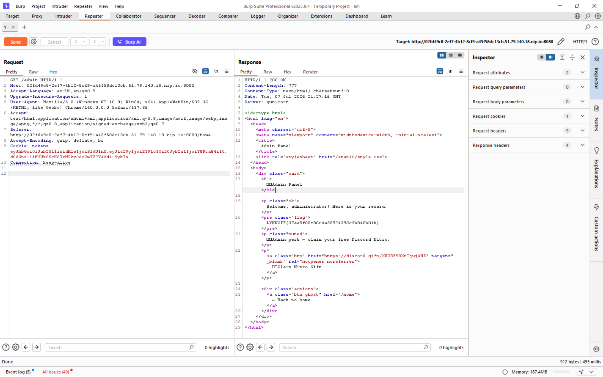
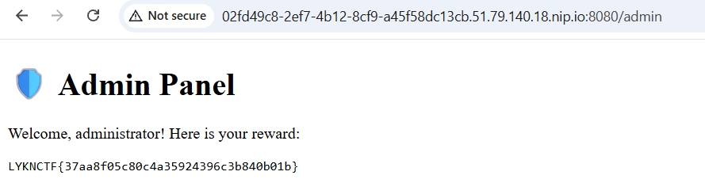

### Mở đầu

Đây hẳn cũng là lần đầu tiên mình quay lại với CTF(s) cùng một mảng mới, khác xa với những gì mình từng thực sự học trước đây, và mở bát với LYKNCTF với kết quả solved được đúng 2/11 challs ;-;, và dưới đây là writeups mảng web của mình.

---
### Right in front of your eyes

Chall này liên tục nhắc nhở mình về việc hẳn chúng ta đã bỏ quên thứ gì đó ở "ngay trước mắt", và đương nhiên là nó vẫn luôn tồn tại. Mình đã thử một vài con đường liên quan khi giải một số vul trước đó, nhưng có vẻ không hiệu quả. Nó vốn không cần phương thức đăng nhập hay gì cả, chỉ mỗi một trang web mang lời nhắc thân thiện tựa vậy thôi.

Và rồi mình nghĩ đến một vul có tên là **file upload vulnerabilities**, kiểu như những file xuất hiện khi truy cập trang web sẽ có thể chứa thông tin gì đó. Cuối cùng thì mình tìm được flag ở đây.

`Flag: LYKNCTF{75f8c0edfe3946149ffc26f86b984c16}`

---
### Discord Nitro
Đăng nhập vào bài lab với user có sẵn `guest:guest`, ta thấy có nút **Go to Admin**, tức là sẽ có phần dành riêng cho tài khoản có quyền admin.

Tuy nhiên khi truy cập vào nút đó (`/admin`) thì quyền truy cập bị từ chối, bởi `guest` không có quyền admin để theo dõi mục này.

Nhưng chúng ta lại nhận được một hint ở bước này, đó là chú ý đến `token` cookie.

Kiểm tra HTTP history khi truy cập /admin, ta thấy chuỗi token cookie là dạng JWT (JSON Web Token) với 2 dấu chấm ngăn cách 3 cụm ký tự khá đặc trưng.

Thường thì JWT sẽ có cấu trúc cơ bản như sau:
`
header.payload.signature
`

Đem decode chuỗi token này theo dạng Base64, ta nhận thấy phần header và payload đã lộ ra, trong đó:

**header:**
`{"alg":"HS256","typ":"JWT"}`
(Tức là thuật toán mã hóa chữ ký (algorithm) là HS256, kiểu token cookie là JWT)

**payload:**
`{"user":"guest","role":"user"}`
(Biểu thị cho tài khoản `guest` có role là `user`)

Tiến hành thay đổi một phần chuỗi JWT bằng cách điều chỉnh header và payload, cụ thể là encode Base64 lại các chuỗi sau:
**header:**
`{"alg":"none","typ":"JWT"}`
(Không yêu cầu mã hóa chữ ký)

**payload:**
`{"user":"guest","role":"admin"}`
(Thay đổi role cho user `guest`)

Chèn phần token cookie mới vào request và gửi lại, nhận được status code 200, đã truy cập được `/admin` cũng như là nhìn thấy nội dung bên trong.

`Flag: LYKNCTF{37aa8f05c80c4a35924396c3b840b01b}`

---
Tiếc cá, chậm chân nên không có Discord nitro 1m rồi T-T